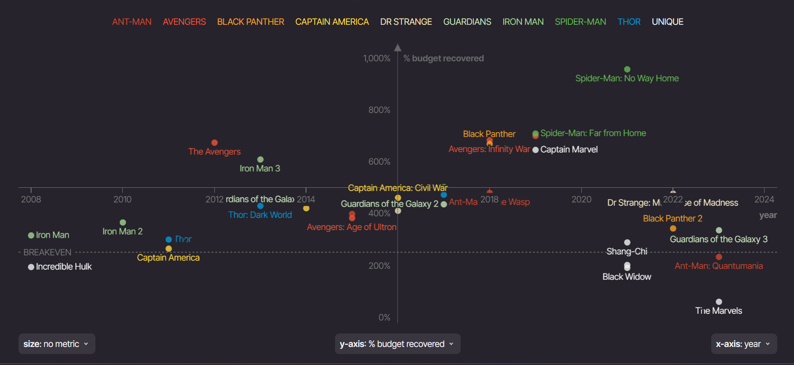

# PROFITABILITY ANALYSIS OF MARVEL MOVIES FRANCHISE

## Introduction
Makeover Monday is an online community that helps us improve how we can better visualize data, one chart at a time. The visualization I chose from Makeover Monday’s repository is from information is beautiful - Which is The Best Performing Marvel Movie?

## Step one: the visualization
https://informationisbeautiful.net/visualizations/which-is-the-best-performing-marvel-movie/

# PROFITABILITY ANALYSIS OF MARVEL MOVIES FRANCHISE
Text here...

_For each step below, you should document your progress as you move forward.  In terms of tone, think of the writeup as though you're keeping journal of your step-by-step process.   You should include a any insights you gained from the critique method, and what it led you to think about when considering the redesign.  You should talk about how you moved next to the sketches, and any insights you gleaned from your user feedback.  Document what you changed based on the user feedback in your redesign.  Finally, talk about what your redesigned data visualization shows, why you selected the data visualization you did, and what you attempted to show or do differently._

_You can include screenshots, sketches or other artifacts with your narrative to help tell the story of how you moved through the process.  Again, make sure to avoid including any personally identifying information about your interviewees (don't list full names, etc.).  While this template serves as a guide, make sure to reference the assignment writeup on Canvas for the official guidance.  This template does not include all guidance mentioned on the assignment page._

## Step two: the critique
The visualization uses various data points and metrics to assess marvel movies performance, beyond just the gross revenue earned from box office providing a balanced view. The data is also displayed in a scatter plot, which allows the audience identify trends and outliers across different metrics. Additionally, it uses different colors to represent movie spinoffs, making it easy to see how it's performance evolved over time from 2008 till present. 

While the data points are plotted on a scatterplot, it would be helpful to be able to identify individual movies franchise and gross revenue earned easily. So if the visualization is maybe broken down to 2 different designs for example broken down in pre-2016 vs post-2016 trend. Also to see the difference between movie performance, present information in a bar-chart to see the stark difference in performance. Also, there was no brief explanation for each metric on the y-axis used. Also, the current Y-axis scale might not be clear for all metrics. I would consider using a consistent scale or adding labels for specific ranges and maybe put different y-axis on different visuals or and put a short textbox explaining the scale of the metrics used and terms that regular people not familiar with movie industry terms may not understand.

I would also recommend using a different visualization like bar chart as the fun interactive nature of the visual might be distracting sometimes because less is more. I would also removing the labels of the movie titles from the scatterplot as each color grade is already defined in the legend. I would also recommend splitting the data into 2 visuals like pre-2016 vs post 2016 to see contrast and movie performance trends across years if we use a bar chart. We can also use a line graph and box plot to show each movie performance trend across the years. I would also avoid using red and green color to depict a movie category because there are some sub conscious thought associated with the colors and can be inferred that Antman and Avengers performed poorly and spiderman the best performing which is not the true across all y-axis metrics.  

## Step three: Sketch a solution

## Step four: Test the solution

Questions to ask (modify these for your own interviews): 

- Can you tell me what you think this is?
- Female in mid 20s shows confusion and asks questions about the Marvel Franchise Category 

- Can you describe to me what this is telling you?

- Is there anything you find surprising or confusing?

- Who do you think is the intended audience for this?

- Is there anything you would change or do differently?

Results: 

_Don't identify or share personally identifiable information (PII) about the people you spoke to._

| Question | Interview 1 | Interview 2 |
|----------|-------------|-------------|
|          |             |             |
|          |             |             |
|          |             |             |

Synthesis: 

_What patterns in the feedback emerge?  What did you learn from the feedback?  Based on this feedback, come up with what design changes you think might make the most sense in your final redesign._

## Step five: build the solution

_Include and describe your final solution here. It's also a good idea to summarize your thoughts on the process overall. When you're done with the assignment, this page should all the items mentioned in the assignment page on Canvas(a link or screenshot of the original data visualization, documentation explaining your process, a summary of your wireframes and user feedback, your final, redesigned data visualization, etc.)._

