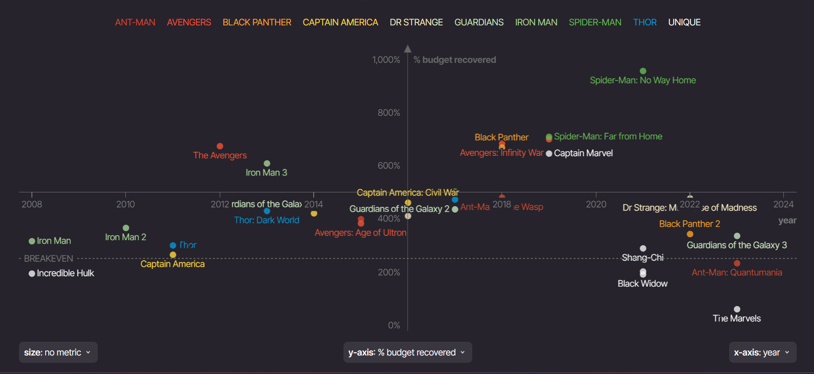

# PROFITABILITY ANALYSIS OF MARVEL MOVIES FRANCHISE

## Introduction
Makeover Monday is an online community that helps us improve how we can better visualize data, one chart at a time. The visualization I chose from Makeover Monday’s repository is from information is beautiful - Which is The Best Performing Marvel Movie?

## Step one: the visualization
https://informationisbeautiful.net/visualizations/which-is-the-best-performing-marvel-movie/

The first thing that stood out to me is that the visualization uses various data points and metrics to assess marvel movies performance, beyond just the gross revenue earned from box office providing a balanced view. The data is displayed in a scatter plot, which allows the audience identify trends and outliers across different metrics. Additionally, it uses different colors to represent movie spinoffs, making it easy to see how it's performance evolved over time from 2008 till present. It also included other factors like audience score, critic score, % of budget recovered etc., offering a more complete picture of a marvel movie's impact. The axes and data points are well-labeled, making the information easy to understand. Also the title is good as it summarizes what story the visualization is telling. The visualization is also interactive which seems fun hence appealing to the audience/fans that watch the movies to explore a specific movie in detail.

## Step two: the critique

While the data points are plotted on a scatterplot, it would be helpful to be able to identify individual movies franchise and gross revenue earned easily. So if the visualization is maybe broken down to 2 different designs for example broken down in pre-2016 vs post-2016 trend. Also to see the difference between movie performance, present information in a bar-chart to see the stark difference in performance. Also, there was no brief explanation for each metric on the y-axis used. Also, the current Y-axis scale might not be clear for all metrics. I would consider using a consistent scale or adding labels for specific ranges and maybe put different y-axis on different visuals or and put a short textbox explaining the scale of the metrics used and terms that regular people not familiar with movie industry terms may not understand.

I would also recommend using a different visualization like bar chart as the fun interactive nature of the visual might be distracting sometimes because less is more. I would also removing the labels of the movie titles from the scatterplot as each color grade is already defined in the legend. I would also recommend splitting the data into 2 visuals like pre-2016 vs post 2016 to see contrast and movie performance trends across years if we use a bar chart. We can also use a line graph and box plot to show each movie performance trend across the years. I would also avoid using red and green color to depict a movie category because there are some sub conscious thought associated with the colors and can be inferred that Antman and Avengers performed poorly and spiderman the best performing which is not the true across all y-axis metrics.  

## Step three: Sketch a solution

## Step four: Test the solution

- Female in mid 20s shows confusion and asks questions about the Marvel Franchise Category.
-  My users said that there are too many colors. 
- There was confusion connecting the title to the legend and how to read the chart. For example, one user was able to infer that Iron Man was one of the best performing movies in 2008, 2010 and 2013. However, it took her time to make that inference because there was discontinuity in between. Iron man was not released in 2011 and 2012, and that discontinuity like this made it difficult to track the movies.
- Users said understanding best performing movies on a per year basis would be information overload. To understand best performing movies, they were looking for information like averages or median or ranges.

Results: 

_Don't identify or share personally identifiable information (PII) about the people you spoke to._

| Question | Interview 1 | Interview 2 |
|----------|-------------|-------------|
|          |             |             |
|          |             |             |
|          |             |             |

Synthesis: 

_What patterns in the feedback emerge?  What did you learn from the feedback?  Based on this feedback, come up with what design changes you think might make the most sense in your final redesign._

## Step five: build the solution

  <noscript>
    
</noscript>
  <object class='tableauViz'  style='display:none;'>
    <param name='host_url' value='https%3A%2F%2Fpublic.tableau.com%2F' /> <param name='embed_code_version' value='3' /> <param name='site_root' value='' />
  <param name='name' value='MarvelProfitabilityAnalysis-TreeMap&#47;ProfitabilityAnalysisTreeMap' />
  <param name='tabs' value='no' />
  <param name='toolbar' value='yes' />
  <param name='static_image' value='https:&#47;&#47;public.tableau.com&#47;static&#47;images&#47;Ma&#47;MarvelProfitabilityAnalysis-TreeMap&#47;ProfitabilityAnalysisTreeMap&#47;1.png' /> 
  <param name='animate_transition' value='yes' />
  <param name='display_static_image' value='yes' />
  <param name='display_spinner' value='yes' />
  <param name='display_overlay' value='yes' />
  <param name='display_count' value='yes' />
  <param name='language' value='en-GB' />
  <param name='filter' value='publish=yes' />
</object>

                

A bar chart showing the

  <noscript>
    
</noscript>
  <object class='tableauViz'  style='display:none;'>
  <param name='host_url' value='https%3A%2F%2Fpublic.tableau.com%2F' /> 
    <param name='embed_code_version' value='3' /> 
    <param name='site_root' value='' /><param name='name' value='Barchart-Marvelprofitability&#47;ProfitabilityAnalysisBarchart' />
    <param name='tabs' value='no' />
    <param name='toolbar' value='yes' />
    <param name='static_image' value='https:&#47;&#47;public.tableau.com&#47;static&#47;images&#47;Ba&#47;Barchart-Marvelprofitability&#47;ProfitabilityAnalysisBarchart&#47;1.png' /> 
    <param name='animate_transition' value='yes' />
    <param name='display_static_image' value='yes' />
    <param name='display_spinner' value='yes' />
    <param name='display_overlay' value='yes' />
    <param name='display_count' value='yes' />
    <param name='language' value='en-GB' />
  </object>

                

<noscript></noscript><object class='tableauViz'  style='display:none;'><param name='host_url' value='https%3A%2F%2Fpublic.tableau.com%2F' /> <param name='embed_code_version' value='3' /> <param name='site_root' value='' /><param name='name' value='Finalmarvelprofitabilityanalysis&#47;Sheet1' /><param name='tabs' value='no' /><param name='toolbar' value='yes' /><param name='static_image' value='https:&#47;&#47;public.tableau.com&#47;static&#47;images&#47;Fi&#47;Finalmarvelprofitabilityanalysis&#47;Sheet1&#47;1.png' /> <param name='animate_transition' value='yes' /><param name='display_static_image' value='yes' /><param name='display_spinner' value='yes' /><param name='display_overlay' value='yes' /><param name='display_count' value='yes' /><param name='language' value='en-GB' /><param name='filter' value='publish=yes' /></object>

