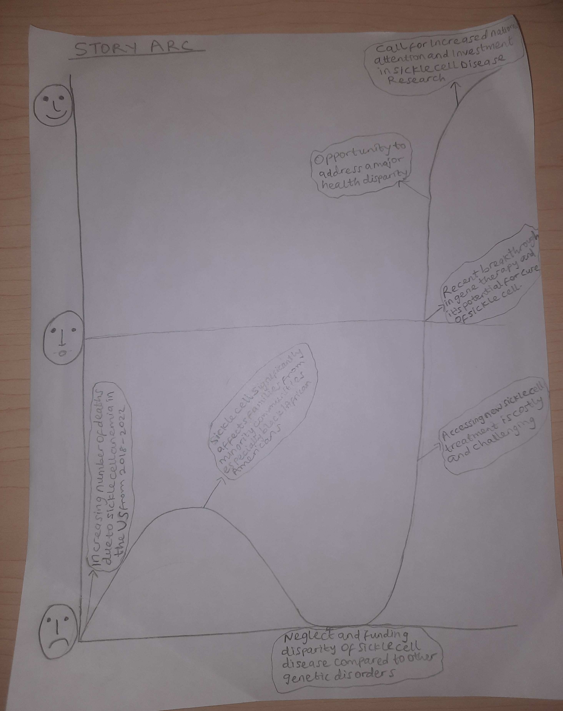
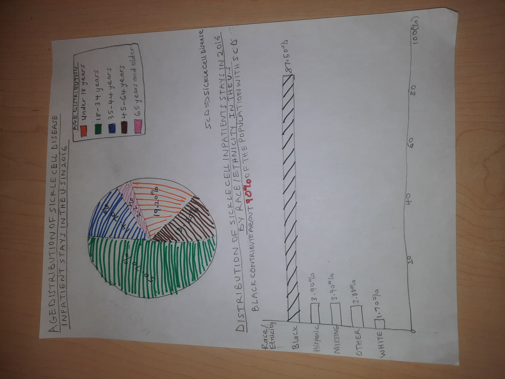
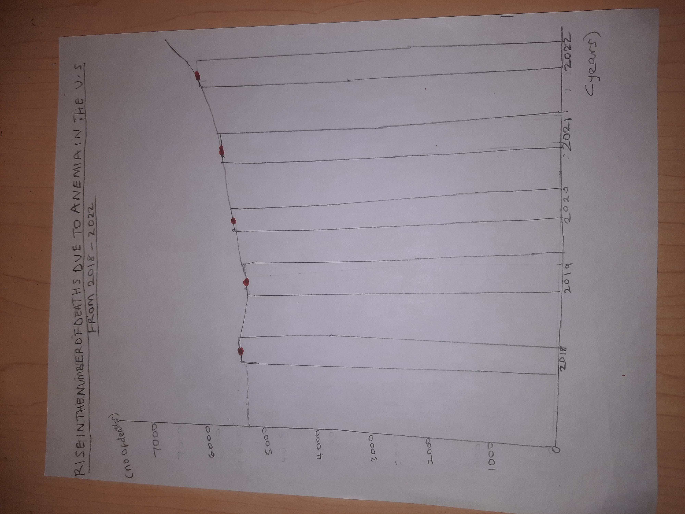

# THE OVERLOOKED CRISIS: WHY MORE ATTENTION NEEDS TO BE PLACED ON SICKLE CELL DISEASE.
## A call for increased attention and funding for Sickle Cell Disease Research in the United States.

# Outline

How does the societal burden of Sickle Cell Disease compare to public awareness and research investment?

## Summary
In light of September being Sickle Cell awareness month, this project aims to highlight the urgent need for increased attention and funding for sickle cell disease (SCD) research in the United States. Sickle cell disease an inherited blood disorder that affects hemoglobin, the protein in red blood cells responsible for carrying oxygen throughout the body. The disease is prevalent in countries in Sub-Saharan Africa and the Carribean usually associated with Malaria. 

Sickle cell disease affects approximately 100,000 Americans (primarily Black/African Americans) which represents about 0.03% of the total U.S. population (assuming a population of around 330 million). It is important to note that while these percentages may seem small to the overall population, it is an urgent health priority because Sickle Cell Disease has a significant impact on those affected and their families, with serious health complications and reduced life expectancy.

In the United States, pregnant Black women who have Sickle Cell Disease have a higher risk of dying which is 10 times higher than the risk faced by pregnant Black women who does not have the disease. Despite the steady growing number of deaths due to Sickle Cell Anemia in the United States, very little has been done in making strides towards a cure. This is due to the disproportionately less attention and funding Sickle Cell Disease has received compared to other genetic disorders. 

Recent scientific breakthroughs, particularly in gene therapy, have opened new avenues for potential cures. However, significant challenges persist particularly regarding accessibility and affordability. By prioritizing Sickle Cell Disease research, we have a unique opportunity to address a major health disparity affecting minority communities, potentially cure a debilitating genetic disorder and reduce long-term healthcare costs associated with the treatment.

## Project Structure:
1. Brief overview of Sickle Cell Disease and its prevalence in the US
2. Sickle Cell Disease Impact on American Health care
- More than 90% of people in the United States with Sickle Cell Disease are non-Hispanic Black or African American, and an estimated 3%–9% are Hispanic or Latino.
- A more recent study estimates that the total number of Sickle Cell Disease cases in 50 states and Washington D.C. in the US was 120,156 cases in 2020. This represent about 0.036% of the U.S. population.
- The overall SCD birth prevalence in the U.S. is estimated at 1 in 2,024 newborns (approximately 0.049% of all newborns)
- Visualization showing how Sickle Cell Diseases disproportionately affects different racial groups (affects 1 in 365 Black or African-American births and 1 in 16,300 Hispanic American births) 
3. Annual economic impact of sickle cell disease: $1.1 billion in healthcare costs
4. Analysis using visual comparison showing how Sickle Cell Disease receives significantly less funding than other genetic disorders including cystic fibrosis, despite it affecting three times as many people in the US.
5. Analysis of racial disparities in medical research funding
6. Recent Breakthroughs showing A Turning Point in Sickle Cell Disease Treatment
- FDA approval of gene therapies Casgevy and Lyfgenia in December 2023
- Potential for CRISPR gene-editing to provide a functional cure
7. Barriers to Progress
- High cost of new therapies: Estimated $2 million per treatment
- Limited access to specialized care centers, especially in rural areas
8. The Economic Case for investment in Sickle Cell Disease Research Funding
- Potential reduction in lifetime healthcare costs for Sickle Cell patients
- Increased workforce productivity with improved patient health outcomes
9. Policy Recommendations
- Increase NIH funding for Sickle Cell Disease research by 50% over the next 5 years
- Create tax incentives for pharmaceutical companies to invest in Sickle Cell Disease cure research
- Expand Medicaid coverage for Sickle Cell Disease treatments and specialized care
10. Potential Outcomes of Increased Investment
- Accelerated development of affordable cures
- Reduced healthcare disparities for minority communities
- Long-term savings for federal health programs

## Story arc

## Initial sketches

# The data
https://hcup-us.ahrq.gov/reports/statbriefs/sb251-Sickle-Cell-Disease-Stays-2016.pdf

https://hcup-us.ahrq.gov/reports/statbriefs/sb251-Sickle-Cell-Disease-Stays-2016.pdf

https://hcup-us.ahrq.gov/reports/statbriefs/sb251-Sickle-Cell-Disease-Stays-2016.pdf

https://wonder.cdc.gov/controller/datarequest/D158

https://report.nih.gov/funding/categorical-spending#/

## Data Source Description
I plan on utilizing data from several sources to build a comprehensive narrative. The primary data sources include the Healthcare Cost and Utilization Project (HCUP) on Statista, the Centers for Disease Control and Prevention (CDC), and the National Institutes of Health (NIH) of which I have attached the link above.

The HCUP statistics on Sickle Cell Inpatient hospital visit provides crucial information on the healthcare burden of Sickle Cell Disease, including the frequency and cost of hospitalizations. This data will be used to illustrate the economic impact of Sickle Cell Disease on the U.S. healthcare system and highlight the potential cost savings that could result from improved treatments or a cure. 

The CDC data shows increasing mortality data related to Sickle Cell Disease, which will be used to demonstrate the life-threatening nature of the disease and appeal to emotion to emphasize the urgent need for increased funding in advancing Sickle Cell Disease research and treatment options. 

Finally, the NIH spending report will be utilized to compare funding allocations for genetic disorder disease and compare funding for Sickle Cell Disease research amongst other genetic disorders to supporting the argument for increased attention and funding resources for Sickle Cell Disease research.

These data sources will be integrated and be particularly useful in setting the stage to highlight the human and economic costs of Sickle Cell Disease which forms the foundation of my call to action. The data sources will also be instrumental in illustrating the historical underinvestment in Sickle Cell Disease research, a key point for my rising action. 

By using these datasets and more I'd add in the future iterations of the project, I aim to create a compelling narrative to my audience (i.e policymaker, healthcare industry and general public) demonstrating the critical need for increasing awareness and prioritizing Sickle Cell Disease research in the United States, which would potentially lead to improved patient outcomes and significant long-term cost savings for the healthcare system.

# Method and medium
I plan to create an interactive presentation using Shorthand, with embedded Tableau visualizations using data representations. Shorthand will allow for a visually engaging narrative flow, while Tableau will enable the creation of more interactive data visualizations. This combination will help effectively communicate the urgency of addressing Sickle Cell Disease to policymakers, healthcare providers, and the general public. It allows me to tell a compelling story on why more funding should be given to sickle cell disease and provides detail required for a policymaker like a U.S. Senator who sits on the Senate Health, Education, Labor, and Pensions (HELP) Committee who have significant influence over health policy and research funding to advocate and act on the issue. The data visualization produced would also be suitable to use for presentations.
