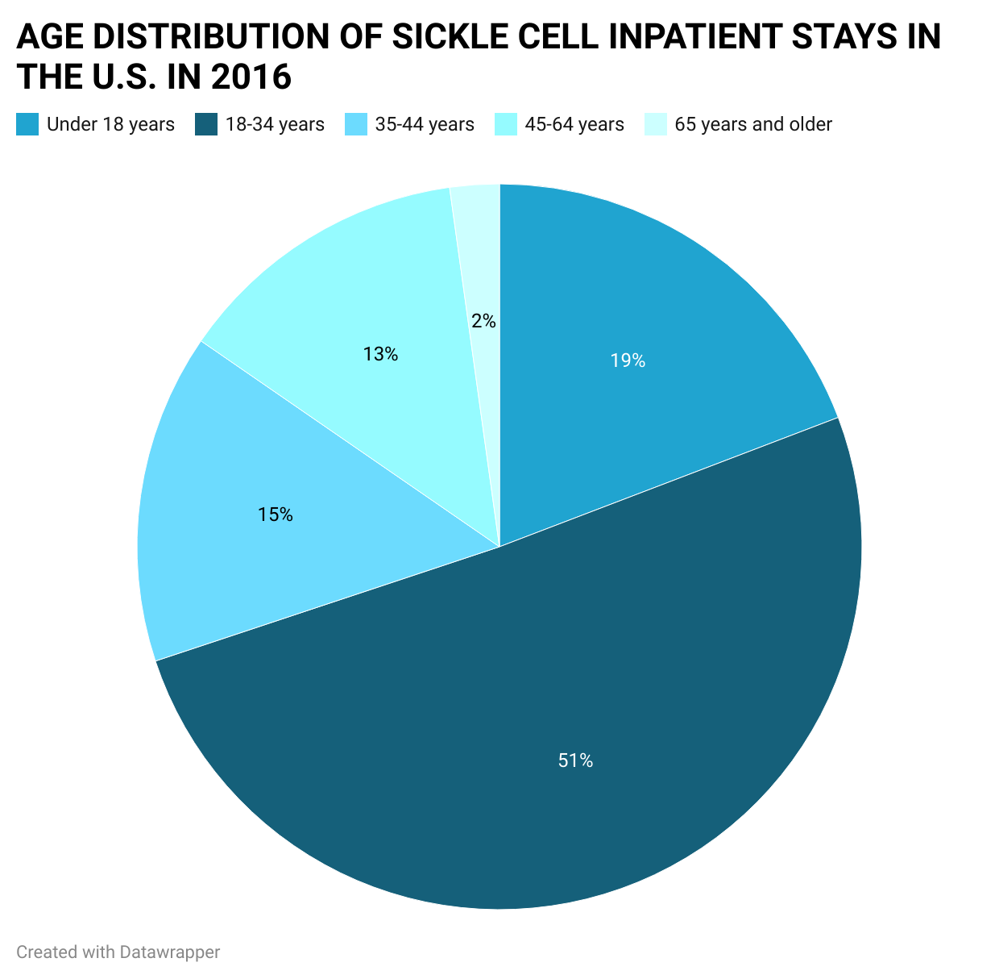
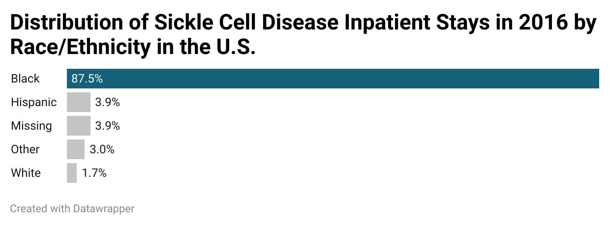
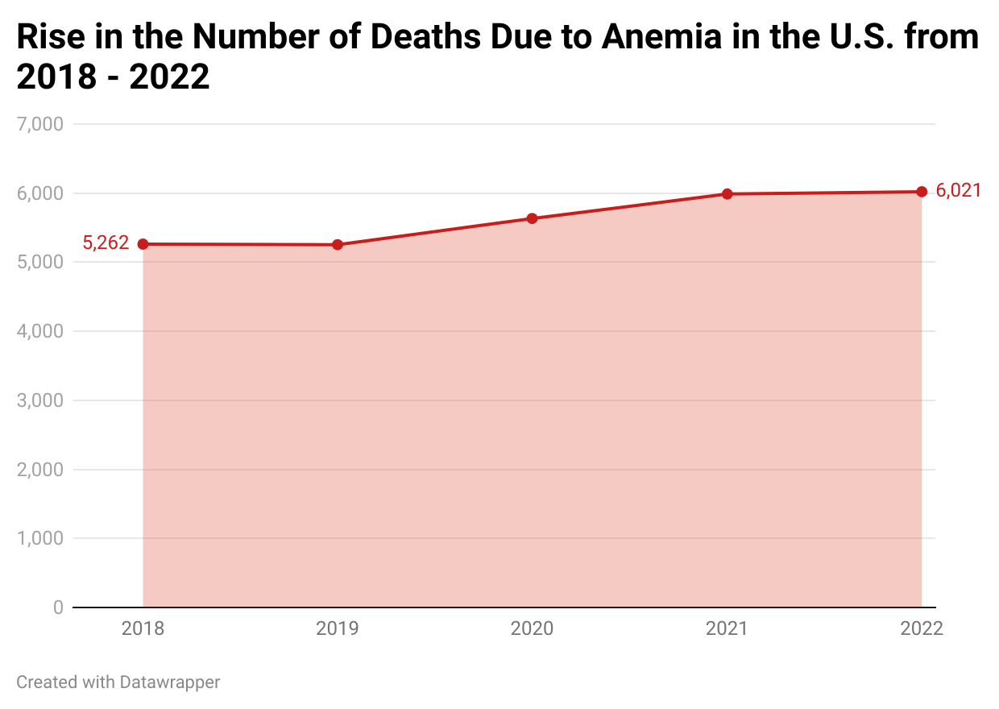
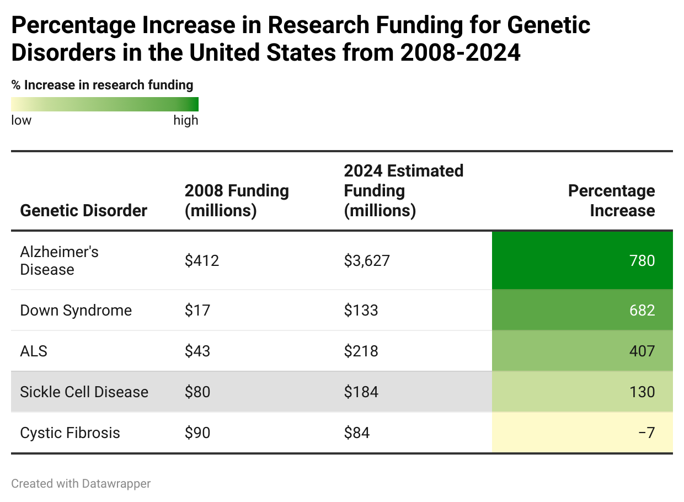

| [home page](https://cmustudent.github.io/tswd-portfolio-templates/) | [visualizing debt](visualizing-government-debt) | [critique by design](critique-by-design) | [final project I](final-project-part-one) | [final project II](final-project-part-two) | [final project III](final-project-part-three) |

# Wireframes / storyboards

> Using your sketches developed last week, further develop your story outline and relevant components visually through the use of wireframing / storyboards. Using your outline as a guide, include high-fidelity, individual draft data visualizations of the critical elements of your story you want to share with your reader. Note: you can build these elements out directly in Shorthand this week if you wish.  Reminder: this template is intended to help, but it doesn't substitute for reading through the full homework assignment!  The assignment page on Canvas includes many important details for completing Part II of the final project. 

Text here!

# User research 

## Target audience
My primary target audience are policymakers, particularly those involved in health policy and research funding decisions in the U.S. like the National Institute of Health, U.S. Senators who sits on the Senate Health, Education, Labor, and Pensions (HELP) Committee in Congress who have significant influence over health policy and research funding to advocate and allocate more funding to Sickle Cell Disease research. 

My secondary audiences might include healthcare providers, the general public and persons living with Sickle Cell Disease since the project also highlights the important role public awareness plays in allocating research funding.

## Approach to Identifying representative individuals to interview:
I plan to select three individuals who represents different aspects of my target audience to interview. For example;
- A person with knowledge of health policy (e.g., a public health phd student, intending health policy maker or health related research professional)
- Someone with a medical background and knowledge of Sickle Cell Disease (e.g., a medical doctor, nurse or medical student)
- A general audience member with no specialized knowledge of Sickle Cell Disease or health policy

# Interview script
"Thank you for participating in this interview". I'm working on a project that highlights the need for increased public awareness on Sickle Cell Disease and making a case for why more attention and funding should be allocated to the it's research in the United States. I'd like to show you some early versions of my visualizations and get your feedback.
## Questions to ask:
- What is your current level of knowledge about Sickle Cell Disease? Have you heard about the disease before?
- Did you know September was Sickle Cell Disease awareness month?
- Do you have any knowledge of Sickle Cell Disease funding or research in the United States?
I show them each wireframe I made and my storyboard on shorthand and ask:
- What is your initial reaction to the visualizations and storyboard?
- Is the main message/ story clear to you? If so, what do you think it is?
- Is there anything confusing or unclear about the visualization?
- Does this information surprise you in any way?
- After seeing all these sections of my story, what do you think is the main point I'm trying to convey?
- Is there any information you feel is missing or that you'd like to know more about in my story?
- Do you find the overall story compelling? Why or why not? How can I improve with audience persuasion aspect of the story
- If you were a policymaker, would this presentation motivate you to take action? Why or why not?
- Do you have any final thoughts or suggestions for improving this presentation?
"Thank you for your time and feedback."

## Goals for my research/project
- Raise awareness about the disproportionate impact of Sickle Cell Disease on minority communities in the United States.
- Highlight the funding disparity between Sickle Cell Disease and other genetic disorders, despite it affecting quite a large number of population.
- Demonstrate the economic burden of Sickle Cell Disease on the U.S. healthcare system and affected individuals.
- Showcase recent breakthroughs in Sickle Cell Disease treatment, particularly gene therapies, to emphasize the potential for progress.
- Illustrate the barriers to accessing new Sickle Cell Disease treatments, including high costs and limited specialized care centers.
- Make a compelling case for increased investment in Sickle Cell Disease research by highlighting potential economic benefits and improved patient outcomes.
- Provide clear policy recommendations to address the Sickle Cell Disease crisis, including increased NIH funding and expanded Medicaid coverage forming my call to action.
- Educate policymakers and the general public about the prevalence and impact of Sickle Cell Disease to advocate for increased attention and resources to the disease.
- Present a clear narrative/story that connects the human impact of Sickle Cell Disease with the potential for scientific advancement/cure for a major health disparity.
- Motivate policymakers particularly those involved in health policy and research funding decisions, to prioritize SCD research and treatment.

## Interview responses
| Questions               | Interview 1 (briefly describe) | Interview 2 | Interview 3 |
|-------------------------|--------------------------------|-------------|-------------|
| What is your knowledge of Sickle Cell Disease?|A black person who has heard about the disease through an EX, knows it's a blood disorder due to genotype, research for the disease not well funded and that it affects black people more|An Asian who has heard about the disease in high school biology class|A white person who didn't know anything about the disease|
| Did you know september was Sickle cell Awareness month?| Didn't know this|Didn't know this|Didn't know this|
| What is your first impression of my storyboard/wireframes visualization|Cool picture, likes the Heading and Subheading used in the shorthand title page. Thinks it places emphasis on Sickle Cell Disease research funding|Thinks it's a cool graphic that is good for the general public who are interested in public health issues|Looks engaging and makes them willing to learn more about the disease as they didn't know the impact of the disease given they've never heard of it before|
| Is there anything confusing or unclear about the visualization?|Maybe add a call out statistic showing the racial disparity of the disease instead of putting it in a text heavy introduction/Digging in part of the story board. Also for the map, people might think sickle cell only exists in the 5 states highlighted and there are no other cases in the greyed out states.|The map doesn't tell much impact of the scale of the disease prevalence in the U.S and suggests to use a proportion to see the scale of impact as the number of cases just seems like population control and not seem dire/important. Also suggests to add infographics and call out statistics for emphasis|Graphs looks good and thinks more light has been shed on the issue to grab their attention. Suggested I add percentages to the charts and graphs. Also prefers I depict the negative increase i.e decrease in funding of -7% in my table chart with a red colour showing a bad thing|
| Does this information surprise you in any way? And If you were a policymaker, would this presentation motivate you to take action? Why or why not?|Found the funding comparison of Sickle Cell Disease and Cystic fibrosis in 2008 surprising seeing that Sickle Cell affects 3 times as many people than Cystic fibrosis also was surprised to see the dramatic increase in funding for other genetic disorders like Downs syndrome and Alzheimers compared to Sickle Cell despite it being present for a long time. Said if they were a policymaker, they would act on the issue and increase funding allocation to the Sickle Cell Disease research as they were convinced. Suggested I add a human story as a testimonial to appeal to emotions|Surprised to see how significant of an issue it is seeing the cost that goes into it's treatment and wonders why it's seriousness wasn't highlighted in their biology class. Also was suprised to see how important knowing your genotype, blood group and rhesus factor is in preventing Sickle Cell Disease. Also suprised to see how much difference sheddding light on the issue played in the funding increase from 2008 to 2024. Agreed to act on the issue if they were a policymaker but would like to see more on the scale or magnitude of the disease impact compared to other genetic disorders. Suprised to see the disproprtionate impact on minority communities and wonders why| Felt very touched by the story and suprised why they hadn't heard about the disease before, Also suprised there was a sickle cell awareness month and promised to read more about the disease. Said they would advocate for increased awareness and funding for the disease if they were a policymaker|

# Identified changes for Part III
Based on the feedback from the interviews above, to effectively address the common themes in the issues that arose especially regarding confusions in the visualization, I plan to;
- Incorporate a persona story on my storyboard to appeal to the audience more
- Also Simplify the visualization of the % prevalence of sickle cell in the map and treemap as well as funding comparisons for the genetic disorders
- Add more infographic and context about the recent breakthroughs in Sickle Cell Disease treatment and potential cure
- Utilize call out statistics in my storyboard to highlight key statistics on racial disparity impact of the disease
- Emphasize the economic impact of increased Sickle Cell Disease funding and the ripple effect it would have in reducing the cost associated with Sickle Cell Disease treatment in the U.S.
- Emphasize the financial burden sickle cell has on people affected and families to make a case why research funding for sickle cell should be increased by at least 50% and medicare coverage for sickle cell treatments should be expanded 

# Persona
Name: Jamal Thompson

Age: 21

Race: Black/African American

Occupation: Student
## Background:
Jamal was diagnosed with SCD at birth. He grew up in a low-income neighborhood in Atlanta, Georgia. Despite his condition, Jamal excelled academically and earned a scholarship to attend college at MIT (Massachusetts Institute of Technology). However, frequent pain crisis, hospitalization and complications makes it difficult for him to lead a normal life and complete his degree on time.
## Daily Life:
- Experiences unpredictable, severe pain crises 4-5 times per month leading to hospitalization
- Takes different medications daily to manage symptoms and prevent complications
- Visits the hospital emergency room 8-10 times per year for chronic pain management, blood transfusions and after care from complications
- Struggles to graduate and gain full-time employment due to frequent health issues
- Relies a lot on family support for transportation to medical appointments and assistance during crisis which is a huge strain physically, mentally, emotionally and financially to the family considering high treatment cost as not all associated cost with his treatments has Medicaid coverage.
## Associated Health Complications:
- Chronic fatigue limiting daily activities and movement like dancing
- Increased risk of infections due to compromised immune system
- Early signs of kidney damage, requiring regular monitoring
- Occasional episodes of acute chest syndrome, a life-threatening complication of Sickle Cell Disease
- Regular joint pains resulting in a limp walk
## Impact on Family:
- Jamal's mother had to reduce her work hours to help care for him during crisis
- His younger sister often feels neglected due to the family's focus on Jamal's health and she has to follow him for most of his appointments and stay with him during hospitalization
- Huge financial strain from medical bills and reduced household income for an already low-income household
## Emotional and Social Challenges:
- Experiences anxiety and depression related to the unpredictability of his condition
- Feels isolated from peers due to frequent hospitalizations and limited energy
- Struggles with romantic relationships due to concerns about passing Sickle Cell Disease to future children
## Dreams and Aspirations:
- Wishes to complete his college degree and start a non-profit for Sickle Cell Warriors
- Hopes for more effective treatments or a cure that would allow him to live pain-free
- Wants to become an advocate for Sickle Cell Disease awareness, improved healthcare access and funding for Sickle Cell Disease research with the hopes of finding a cure for the disease.
## Quote from Jamal:
"Living with sickle cell is like having a time bomb in your body. You never know when the pain will strike or how bad it will be and this is when you'd die. I just want a chance to live my life without constantly fearing the next crisis."
